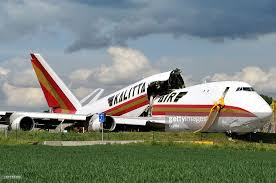
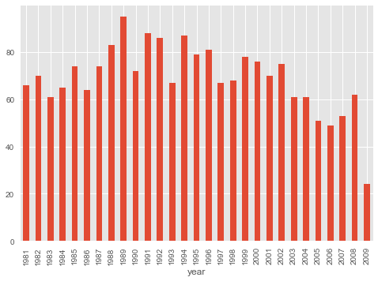
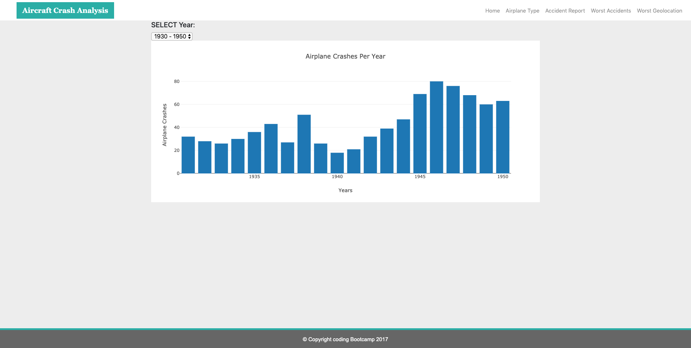
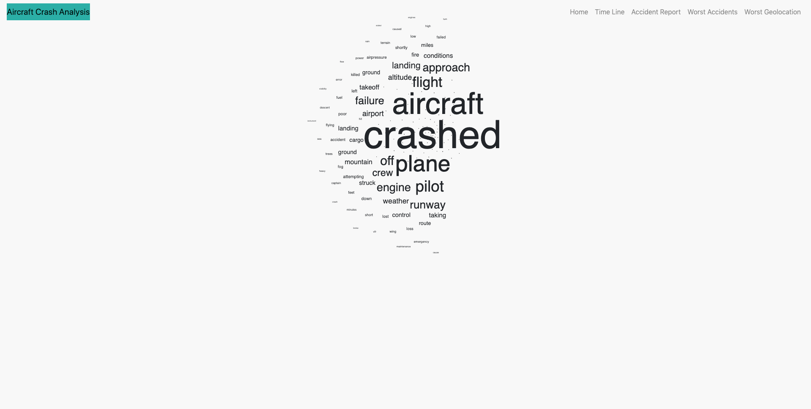
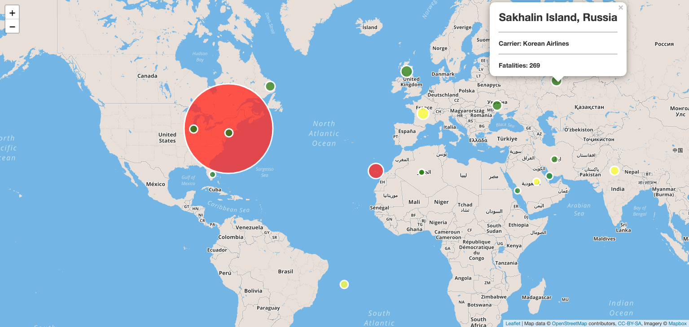
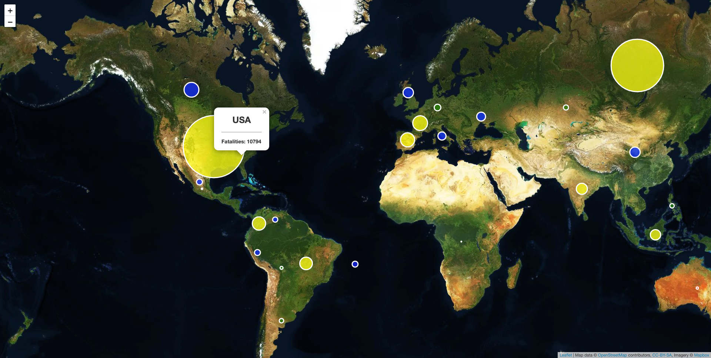

# Aircraft_Crash_Analysis
                                         

## Background

Flying is considered as the safest way to travel as of today. But has that always been the case? Was flying as safe in the 20th century? Most of us have boarded an airplane manufactured by Boeing and Airbus, which are two of the biggest and most popular commercial flight manufacturers in the world. How many planes that have been manufactured by them have crashed in the past? What were some of the most common reasons for the crashes? It is questions like these that fueled our curiosity and interest towards this project- Aircraft crash analytics- a visual exploration of aircraft crashes since 1908.

The aviation industry is a mature industry, and is more than a hundred years old. So, there exists a lot of data in this field, especially aircraft crash data. This makes it very interesting, as we were able to grab data that helped us analyse the state of the aircraft safety over a period of an entire century!

Through this project we have explained in detail, the methodology and tools used for implementing the data pipeline, right from getting the data from CSV file,cleaning and formatting data in jupyter notebook,loading the data in PostgreSQL Database and querying data so we can represnt it in an understandable and attractive visiualization.

## Structure:

The project is divided logically into three parts:

## Part 1- Data Collection
For this project data is mainly collected from
* aviation-safety.net/airlinesafety/
* Keggle.com/aircrash-data

## Part 2- Data Analysis
After successfully collecting the data we imported it to jupyter notebook.We have done Data cleaning and date formating in jupyter notebook.Created corresponding tables in PostgreSQL. Then converted the csv data into dataframes and used SQLAlchemy to insert data into PostgreSQL Database. Used Flask to create various routes to get data from the database in JSON format.

## Part 3- Data Visualization
For Data Visualization part we created a Bar Plot which shows the year wise crash data with total number of incidents per year.

We have also daynamically queried the postgreSQL database and retreived data from Flask server in JSON format for every 20 years ( the year range is selected from a drop down list) and plotted it in a bar chart as shown in below figure. 

We have created a word-cloud map using javascript library where we are analysing what is the most frequent cause of the accidents. The size of the displayed word in the word-cloud is based on the frequency of the word occured. The size of the word will allow us to visually understand the most frequent reasons for the cause of airplane accidents.

We have done further visualization using Leaflet.

We have created a map using Leaflet that plots worst geographical location which is prone to crash and one more map which shows the deadliest accident happened in last 100 years based on their longitude and latitude.
    
   * data markers is reflecting the magnitude of the fatalities in their size and color.Fatalities with higher magnitudes appeared in larger and different in color according to fatalities rate.

   * Include popups that provide additional information about the crash when a marker is clicked.

   * Create a legend that will provide context for our map data.

   * our Worst geographical location map looks something like the map below and dedliest accident map looks something like the above map.
   
   

Conclusions:
    The data and visualization show that in 20th century the airplane accident rate was more when compared to recent times; but will this allow us to come to a conclusion that airplanes are more safer now compared to the previous century? We couldn't come to a conclusion based on our visualizations. Further angles of analysis might provide us a better insight into the airplane crash analysis.

- - -

### Copyright

Trilogy Education Services © 2019. All Rights Reserved.
